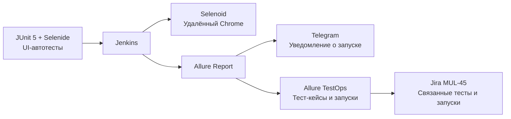
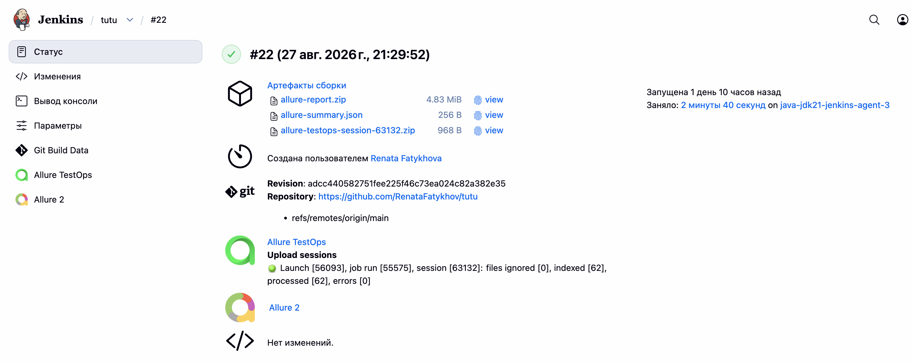
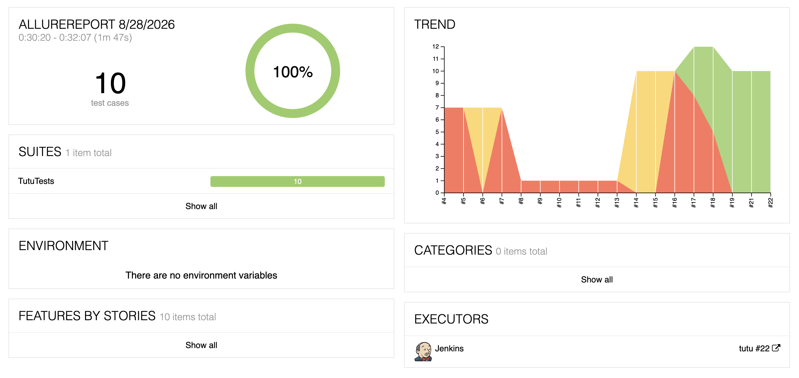
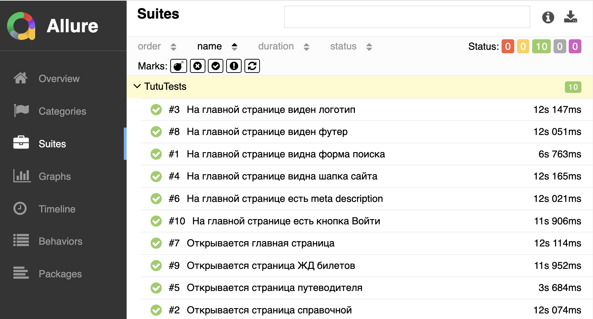
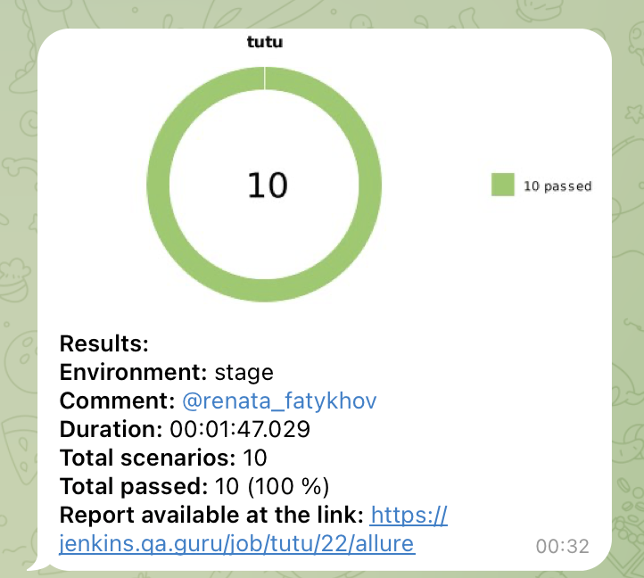
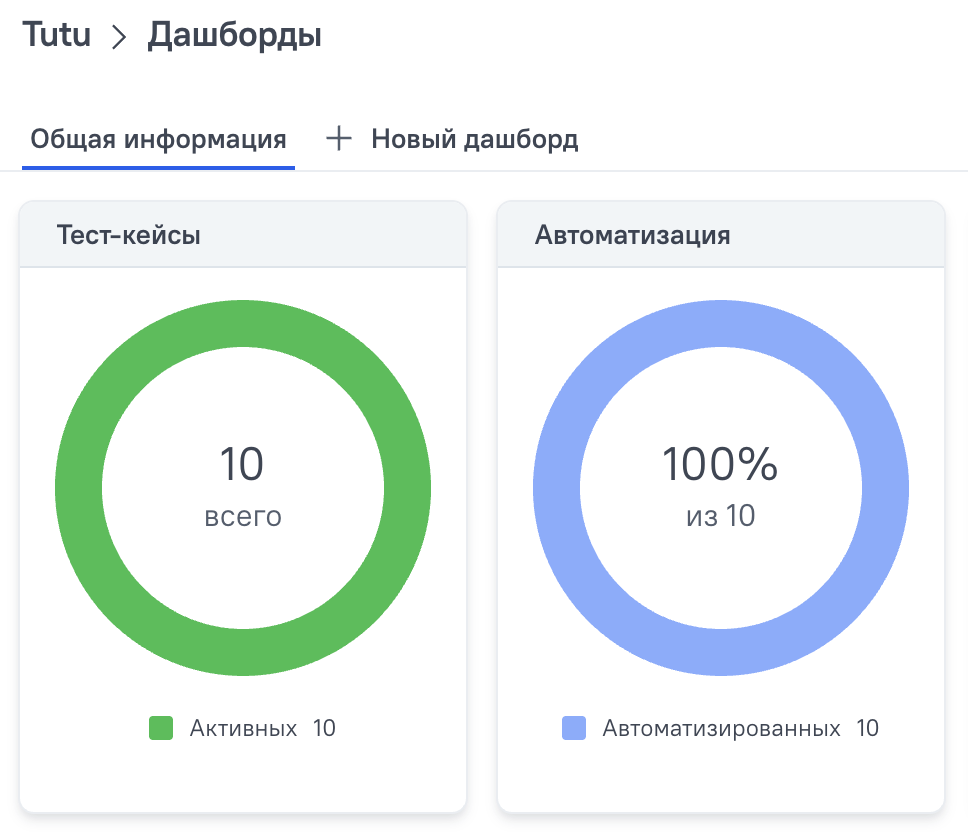

<h1 align="center">Автотесты для Tutu.ru</h1>

<h2 align="center">Учебный проект с UI-автотестами для сайта <a href="https://www.tutu.ru/">Tutu.ru</a>. Тесты написаны на Java с использованием Selenide и JUnit 5; результаты формируются в Allure Report.</h2>

<p align="center">
  <a href="https://www.tutu.ru/"></a>
</p>

## Схема проекта



Тесты организованы по паттерну Page Object: сценарии находятся в `TutuTests`, а действия и проверки страницы - в `pages/TutuMainPage`.

## Технологии

<p align="left">
  <a href="https://www.oracle.com/java/"></a>
  <a href="https://gradle.org/"></a>
  <a href="https://junit.org/junit5/"></a>
  <a href="https://selenide.org/"></a>
  <a href="https://allurereport.org/"></a>
  <a href="https://www.jenkins.io/"></a>
  <a href="https://allurereport.org/allure-testops/"></a>
  <a href="https://www.atlassian.com/software/jira"></a>
</p>

## Тест-кейсы

| № | Тест-кейс | Что проверяется |
| --- | --- | --- |
| 1 | Открывается главная страница | Адрес соответствует главной странице Tutu.ru |
| 2 | Видна шапка сайта | Отображается видимый экземпляр шапки |
| 3 | Есть meta description | Description содержит ключевую информацию о сервисе |
| 4 | Видно логотип | Отображается логотип со ссылкой на главную страницу |
| 5 | Видна форма поиска | Отображается форма поиска билетов |
| 6 | Есть кнопка «Войти» | Отображается кнопка входа с корректным текстом |
| 7 | Виден футер | После прокрутки отображается футер сайта |
| 8 | Открывается справочная | Открываются URL `/2read/` и страница «Справочная Tutu.ru» |
| 9 | Открывается путеводитель | Открываются URL `/geo/` и страница путеводителя |
| 10 | Открывается страница ЖД-билетов | Открываются URL `/poezda/` и страница с расписанием поездов |

## Особенности реализации

- Для каждого действия в Allure добавлены понятные шаги через `@Step` и `AllureSelenide`.
- Для элементов с несколькими вариантами разметки выбирается видимый экземпляр через `$$().findBy(visible)`.
- URL нормализуются перед сравнением, поэтому двойной слэш после домена не влияет на результат проверки.
- После каждого теста к Allure-отчёту прикладываются скриншот, исходный код страницы, логи браузера и видео запуска.

## Запуск

Локальный запуск:

```bash
./gradlew clean test
```

В Jenkins тесты запускаются в удалённом Chrome через Selenoid. После выполнения Jenkins публикует Allure Report.

## Результаты тестирования

В [прогоне Jenkins №22](https://jenkins.qa.guru/job/tutu/22/allure/#suites/9d9746198fda9b3d1f038c735e93d3e4) успешно выполнены все 10 автотестов.

| Всего тестов | Успешно | Процент прохождения | Длительность |
| --- | --- | --- | --- |
| 10 | 10 | 100 % | 00:01:47 |

### Jenkins

Тесты запускаются в [Jenkins job `tutu`](https://jenkins.qa.guru/job/tutu/). Jenkins собирает проект из GitHub, запускает тесты в Selenoid и публикует артефакты Allure Report и Allure TestOps.



### Allure Report

Allure-отчёт содержит общую статистику, историю запусков, список тестов и детализацию каждого сценария с шагами выполнения и вложениями.





## Интеграции

### Telegram

После завершения прогона настроено автоматическое Telegram-уведомление: оно содержит круговую диаграмму, число пройденных тестов, длительность и ссылку на Allure Report.



### Allure TestOps

Проект интегрирован с [Allure TestOps](https://allure.qa.guru/project/5371/dashboards). На дашборде заведены 10 активных тест-кейсов, и все 10 отмечены как автоматизированные.



### Jira

Настроена интеграция Jira и Allure TestOps. В [задаче MUL-45](https://jira.qa.guru/browse/MUL-45) отображаются связанные автотесты и результаты их запусков, поэтому статус разработки и результаты тестирования доступны в одной задаче.

## Автор

**Фатыхова Рената Рашидовна**
Auto QA

### Контакты для связи

- Email: [renata.musenova@gmail.com](mailto:renata.musenova@gmail.com)
- Телефон: [+7 917 240-33-84](tel:+79172403384)
